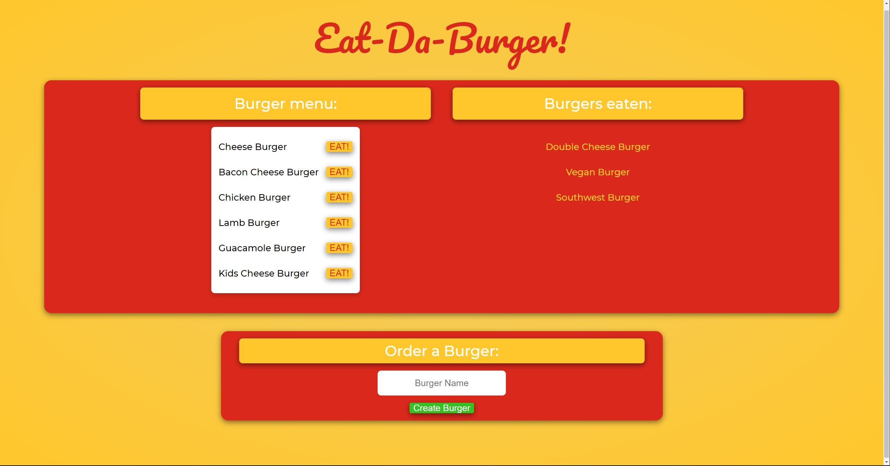

# Eat-Da-Burger /  Express Handlebars 
   

  This is a resturant app that lets the user input burgers they would like to eat! When a user selects the EAT button, the burger is moved from the burger menu to the eaten list. The user can enter as many burgers as the want!

  
  
  Live Heroku Link: [Eat-Da-Burger](https://burger-express-collin.herokuapp.com/)

  ## Table of Contents

  - [Installation](#installation)
  - [Usage](#usage)
  - [License](#license)
  - [Contributing](#contributing)
  - [Tests](#tests)
  - [Questions](#questions)

  ## Installation

  This app is launched on Heroku where you can test it out. Fell free to clone the repo and run it on your own localhost to play around with it!

  ## Usage

  This project uses MySQL, Node, Express, Handlebars, and a homemade ORM! The site follows MVC design patters and queries and routes all of the data through a database! The site is generated using the HTML Handelbars.

  ## License

  This aplication is made with the [MIT License](https://opensource.org/licenses/MIT)

  ## Contributing

  If you want to contribute, please contact me!

  ## Tests

  If you find any bugs please let me know!

  ## Questions

  For any questions you might have, you can email me at wilsoncollin7@gmail.com. You can also check out my [GitHub Profile](https://github.com/wilsoncollin7).

